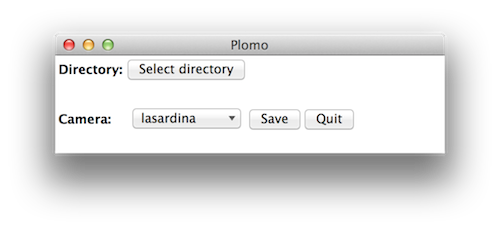

# plomo

Batch write Exif info to scans of your analogue photos 

    pip install plomo

### Usage

```
plomo [-h] [-g] [--path PATH] [--camera CAMERA]

optional arguments:
  -h, --help       show this help message and exit
  -g, --gui        View the graphical interface
  --path PATH      Path to the photo or the folder containing the photos you
                   want to manipulate the Exif information
  --camera CAMERA  Choose one of the following cameras: "fisheye2",
                   "fisheye1", "lcw", "lca", "holga120n", "lasardina",
                   "holga120fn", "dianaf+"
```



### Run tests
Clone repository and run `python -m plomo.tests`


